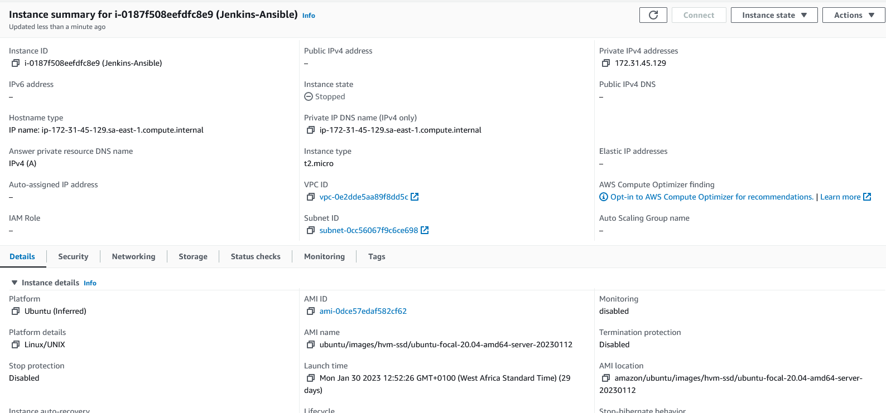
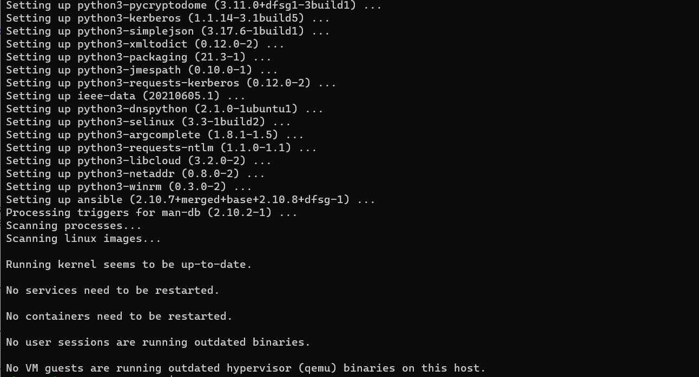
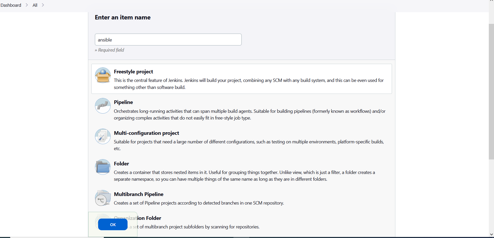
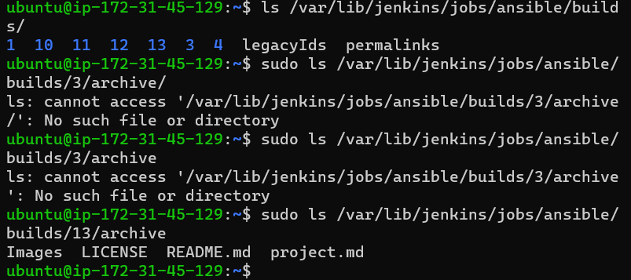
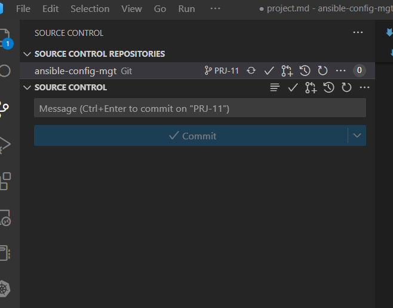
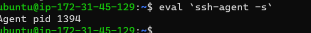

#Install and configure Ansible on EC2 Instance

1.Update Name tag on your Jenkins EC2 Instance to Jenkins-Ansible

2.In your GitHub account create a new repository and name it ansible-config-mgt

[]Jenkins-ansible instance

3.Install Ansible

`sudo apt update`

`sudo apt install ansible`

[]Check your Ansible version by running 
`ansible --version`

4.Configure Jenkins build job to save your repository content every time you change it

-Jenkins page 18.230.139.254:8080
-admin password d84735f4243e4faf8ea684558518804e

[]Create a new Freestyle project ansible in Jenkins and point it to your ‘ansible-config-mgt’ repository

[]Configure Webhook in GitHub and set webhook to trigger ansible build
-Repository https://j-raji.github.io/ansible-config-mgt/
-Webhook http://15.228.170.184:8080/github-webhook

[]Configure a Post-build job to save all (**) files

5.Test your setup by making some change in README.MD file in master branch and make sure that builds starts automatically and Jenkins saves the files (build artifacts) in following folder 

`sudo ls /var/lib/jenkins/jobs/ansible/builds/13/archive/`

##step2

[] clone repo in VS

`git clone git@github.com:J-Raji/ansible-config-mgt.git`

#Begin Ansible Development

1.Create branch PRJ-11

2.Check branch in local machine

3.Create a directory playbooks

`mkdir playbooks`

4.create a directory inventory
`mkdir inventory`

5.Within playbooks directory, create  common.yaml

`cd playbooks`

`nano common.yml`

6.Within inventory,create an inventory file (.yml) for each environment (Development, Staging Testing and Production) dev, staging, uat, and prod respectively.

`cd inventory`

`touch dev.yml staging.yml uat.yml prod.yml`

[]Setup an ansible inventory 

-[]Setup ssh agents

``eval `ssh-agent -s``

`ssh -i "jen-key.pem" ubuntu@ec2-15-228-3-187.sa-east-1.compute.amazonaws.com`

[]Update your inventory/dev.yml file with this snippet of code:
[nfs]
172.31.12.2 ansible_ssh_user='ec2-user'

[webservers]
172.31.5.149 ansible_ssh_user='ec2-user'
172.31.1.20 ansible_ssh_user='ec2-user'

[db]
172.31.8.204 ansible_ssh_user='ec2-user' 

[lb]
172.31.6.107 ansible_ssh_user='ubuntu'

#Create common playbook

[]Update common.yml file

---
- name: update web, nfs and db servers
  hosts: webservers, nfs, db
  remote_user: ec2-user
  become: yes
  become_user: root
  tasks:
    - name: ensure wireshark is at the latest version
      yum:
        name: wireshark
        state: latest

- name: update LB server
  hosts: lb
  remote_user: ubuntu
  become: yes
  become_user: root
  tasks:
    - name: Update apt repo
      apt: 
        update_cache: yes

    - name: ensure wireshark is at the latest version
      apt:
        name: wireshark
        state: latest

[]commit code to github

1.use git commands to add, commit and push your branch to GitHub

`git status`

`git add <selected files>`

`git commit -m "commit message"`

2.Create a Pull request (PR)
`git pull`

[]Install wireshark

`sudo apt install wireshark-qt`

`wireshark --version`

