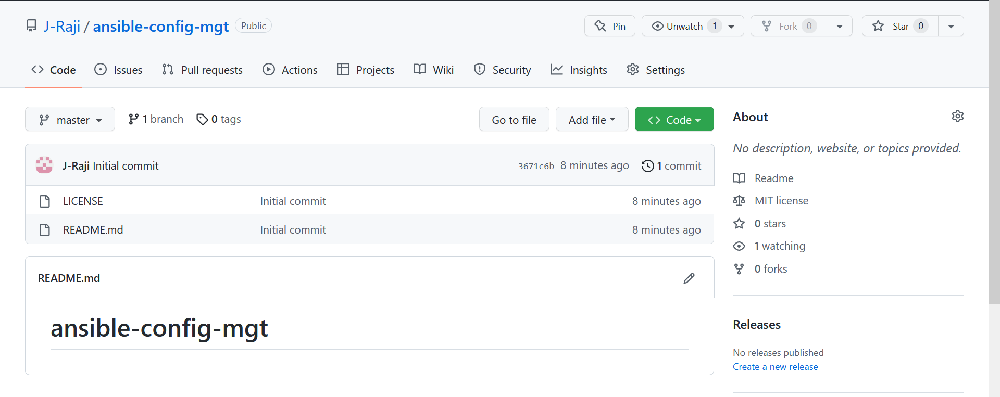

#Install and configure Ansible on EC2 Instance

1.Update Name tag on your Jenkins EC2 Instance to Jenkins-Ansible

2.In your GitHub account create a new repository and name it ansible-config-mgt

[]Jenkins-ansible instance

3.Install Ansible

`sudo apt update`

`sudo apt install ansible`

[]Check your Ansible version by running 
`ansible --version`

4.Configure Jenkins build job to save your repository content every time you change it

-Jenkins page 15.228.170.184:8080
-admin password d84735f4243e4faf8ea684558518804e

[]Create a new Freestyle project ansible in Jenkins and point it to your ‘ansible-config-mgt’ repository

[]Configure Webhook in GitHub and set webhook to trigger ansible build
-Repository https://j-raji.github.io/ansible-config-mgt/
-Webhook http://15.228.170.184:8080/github-webhook

[]Configure a Post-build job to save all (**) files

